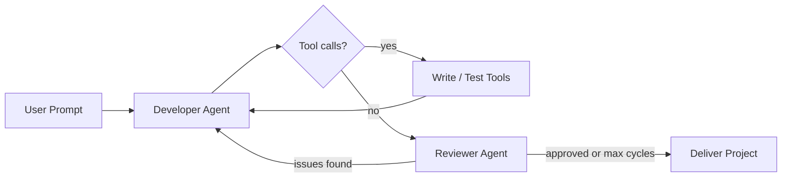

# Autonomous Multi-Agent AI Software Engineering Team

An explicit, self-correcting multi-agent development pipeline built with **LangGraph**, **Google Gemini**, and **Docker**. The system orchestrates an autonomous developer and a dedicated QA reviewer to write, containerize, execute, debug, and validate Python code completely from scratch based on a single user prompt.

---

## Architecture Overview

The system uses an explicit LangGraph state machine with developer, tool execution, and reviewer nodes:



### Core Engine Pillars

1. **The Developer Agent:** Translates requirements into project files, generates sample data, and runs code in the sandbox.
2. **The Docker Sandbox Tool:** Runs code in an ephemeral, network-disabled `python:3.11-slim` container with a read-only project mount, memory cap (`256m`), and execution timeout.
3. **The Reviewer Agent:** Audits implementation logic, documentation, and style. It loops control back to the developer when issues are found, up to a configurable cycle limit.

---

## Features

* **Complete Isolation:** Code runs inside decoupled Docker environments with a strict memory cap and deactivated network links.
* **Closed-Loop Self-Healing:** The developer agent reads sandbox `stderr` output and fixes runtime errors autonomously.
* **Dual-Agent Reflection:** The developer creates assets; the reviewer verifies them before delivery.
* **Safety Guardrails:** Path traversal protection, read-only sandbox mounts, and a max review-cycle limit prevent runaway loops.

---

## Getting Started

### Prerequisites

* Python 3.11+
* Docker Desktop running on your machine
* A Google Gemini API Key

### Installation

1. **Clone the Repository:**

   ```bash
      https://github.com/QuratulAin20/Agents.git
      cd deep-agent-coding
   ```

2. **Create and Activate a Virtual Environment:**

   ```bash
   python -m venv code_agent_env

   # On Windows Command Prompt:
   code_agent_env\Scripts\activate

   # On Linux/macOS:
   source code_agent_env/bin/activate
   ```

3. **Install Dependencies:**

   ```bash
   pip install -r requirements.txt
   ```

4. **Environment Setup:**

   Create a `.env` file in the root project folder:

   ```env
   GOOGLE_API_KEY="AIzaSyYourActualGeminiKeyHere"
   GOOGLE_MODEL="gemini-2.5-flash"
   USE_DOCKER_SANDBOX=True
   EXECUTION_TIMEOUT_SECONDS=15
   MAX_REVIEW_CYCLES=5
   ```

### Usage

Run the main orchestrator script from your console:

```bash
python main.py
```

Enter your design request when prompted:

```text
> Build a command-line script that reads a CSV file of sales data, handles missing values (nulls), formats date strings correctly, and prints a summary report showing total revenue per product line. Generate a mock CSV file inside the project directory first so you can test it.
```

Monitor your shell to view agent transitions, Docker execution logs, and reviewer checkpoint validation output in real time. Completed codebases are stored under the `./projects/` directory.

### Testing

Run the unit tests with:

```bash
pytest
```

---

## Sandbox Constraints

Generated code must use the **Python standard library only**. The default Docker image has no third-party packages installed, and network access is disabled inside the container. This keeps execution predictable and safe.

---

## Configuration

| Variable | Default | Description |
|----------|---------|-------------|
| `GOOGLE_API_KEY` | — | Gemini API key |
| `GOOGLE_MODEL` | `gemini-2.5-flash` | Model used by both agents |
| `USE_DOCKER_SANDBOX` | `True` | Enable Docker isolation |
| `EXECUTION_TIMEOUT_SECONDS` | `15` | Sandbox run timeout |
| `MAX_REVIEW_CYCLES` | `5` | Max developer/reviewer loops |

`EXECUTION_TIMEOUT` is also accepted as a legacy alias for `EXECUTION_TIMEOUT_SECONDS`.
