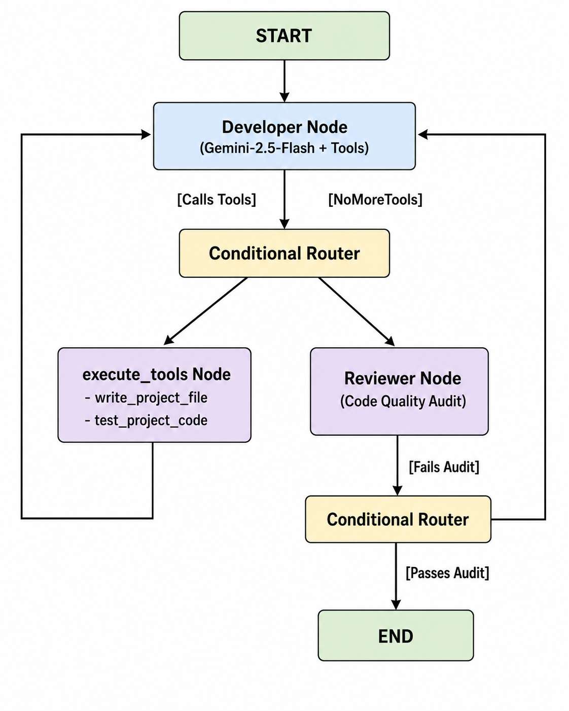

# Autonomous Multi-Agent AI Software Engineering Team

An explicit, self-correcting multi-agent development pipeline built with **LangGraph**, **Google Gemini**, and **Docker**. The system orchestrates an autonomous developer and a dedicated QA reviewer to write, containerize, execute, debug, and validate Python code completely from scratch based on a single user prompt.

---

## Architecture Overview

The system bypasses fragile high-level framework wrappers by constructing an explicit, predictable state machine utilizing LangGraph nodes:



### Core Engine Pillars

1. **The Developer Agent:** Translates requirements into an initial project architecture plan, generates file blueprints, and modifies disk state.
2. **The Docker Sandbox Tool:** Instantiates an ephemeral, network-disabled `python:3.11-slim` container, securely mounts the local project folder, runs code, and pipes real-time `stdout`/`stderr` arrays back to the graph state.
3. **The Reviewer Agent:** Intercepts the workflow post-execution. It audits implementation logic, handles edge-case checks, reviews PEP 8 formatting style, and loops control back to the Developer node if issues are found.

---

## Features

* **Complete Isolation:** Code runs inside decoupled Docker environments with a strict memory cap (`256m`) and deactivated network links to prevent untrusted execution vulnerabilities.
* **Closed-Loop Self-Healing:** The developer agent natively reviews runtime execution traces (`stderr`) inside the sandbox environment to fix typos, import errors, or syntax bugs autonomously.
* **Dual-Agent Reflection:** High-level separation of concerns ensures that the asset-creation layer (Developer) is explicitly verified by an analytical audit layer (Reviewer).

---

## Getting Started

### Prerequisites

* Python 3.11+
* Docker Desktop running on your machine
* A Google Gemini API Key

### Installation

1. **Clone the Repository:**

   ```bash
   git clone [https://github.com/your-username/deep-agent-coding.git](https://github.com/your-username/deep-agent-coding.git)
   cd deep-agent-coding

   ```

2. **Create and Activate a Virtual Environment:**

   ```bash
   python -m venv code_agent_env

   # On Windows Command Prompt:
   code_agent_env\Scripts\activate

   # On Linux/macOS:
   source code_agent_env/bin/activate

   ```

3. **Install Dependencies:**

```bash
pip install -r requirements.txt

```

1. **Environment Setup:**
Create a `.env` file in the root project folder:

```env
GOOGLE_API_KEY="AIzaSyYourActualGeminiKeyHere"
GOOGLE_MODEL="gemini-2.5-flash"
USE_DOCKER_SANDBOX=True
EXECUTION_TIMEOUT_SECONDS=10

```

### Usage

Run the main orchestrator script from your console:

```bash
python main.py

```

Enter your design request when prompted:

```text
> Build a command-line script that reads a CSV file of sales data, handles missing values (nulls), formats date strings correctly, and prints a summary report showing total revenue per product line. Generate a mock CSV file inside the project directory first so you can test it.

```

Monitor your shell to view the agent transitions, Docker execution logs, and the reviewer checkpoint validation output in real time. Completed codebases will be securely stored under the `./projects/` directory.
